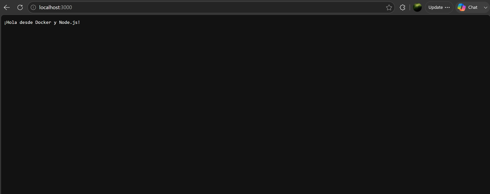

# hello-node

## Nombre del estudiante
Alvaro Torrez Calle

## Explicación breve de la aplicación
Aplicación Node.js muy simple que levanta un servidor HTTP con el módulo nativo `http`. Al recibir una petición, responde con el texto `¡Hola desde Docker y Node.js!`. El proyecto se usa como práctica para construir una imagen Docker y ejecutar la aplicación dentro de un contenedor, escuchando en el puerto `3000`.

## Comando utilizado para construir la imagen
```bash
docker build -t hello-node .
```

## Comando utilizado para ejecutar el contenedor
```bash
docker run -d -p 3000:3000 --name hello-node-container hello-node
```

La aplicación queda disponible en [http://localhost:3000](http://localhost:3000).

## Captura de `docker images y docker ps`


## Captura de la aplicación funcionando en el navegador

